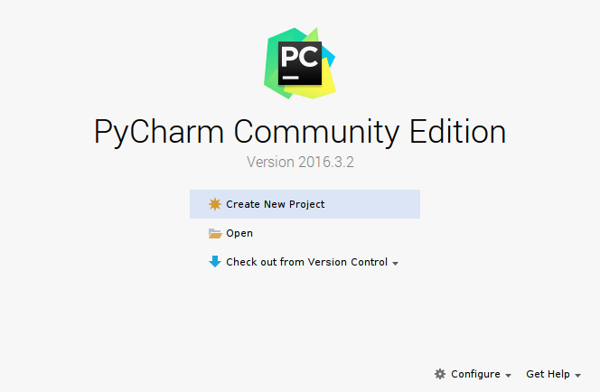
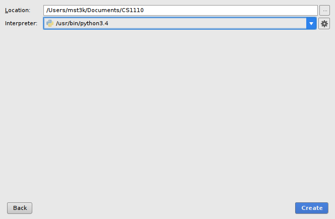

---
title: "Lab 1: Installing Python and PyCharm"
...

Lab this week is optional in that we will not be taking roll.
However, this is an opportunity to come to ensure that you have Python and PyCharm installed and working properly on your laptops. 
If you do not come to lab, we will assume you have taken care of this yourself and you are ready to go when we start coding in lecture next week. 
So, if you have any doubts, come on down to lab, meet some of the TAs, and make sure you're laptop is setup and ready to go!

# Installing

## On Windows

### Python

1.  Download the Python installer at
    [https://www.python.org/ftp/python/3.6.0/python-3.6.0.exe](https://www.python.org/ftp/python/3.6.0/python-3.6.0.exe)
    and then double-click the download to start the installation.

2.  Choose "Custom Installation" and click Next.
    Make sure "Add Python to environment variables" is checked. Then click Install.

### Pycharm

You should install Python before you install PyCharm.

1.  Download the PyCharm Community Edition installer at
    [https://www.jetbrains.com/pycharm/download/](https://www.jetbrains.com/pycharm/download/download-thanks.html?platform=windows&code=PCC).
    Double-click the download to start the installation.

2.  At the Installation Options screen, make sure to check "Create associations" - ".py".

## On Mac

### Python

1.  Download the Python installer at
    [https://www.python.org/ftp/python/3.6.0/python-3.6.0-macosx10.6.pkg](https://www.python.org/ftp/python/3.6.0/python-3.6.0-macosx10.6.pkg)
    and then double-click the download to start the installation.

### PyCharm

You should install Python before you install PyCharm.

1.  Download the PyCharm Community Edition installer at
    [https://www.jetbrains.com/pycharm/download/](https://www.jetbrains.com/pycharm/download/download-thanks.html?platform=mac&code=PCC).
    Double-click the download to mount the image.
    Drag the icon to the Applications folder.

## On Other Systems

If you are using a system other than Windows or Mac, post what system you are using on Piazza
and we'll help get you set up.

# First PyCharm run

To verify that your installation worked,

1. Run PyCharm

2. Accept the default options in the various screens that pop up asking you to set up various aspects of PyCharm.
    These should only appear the first time you run PyCharm.

3.  When you reach the welcome screen

    
    
    select "Create new project".
    
    If you have already created a project, it will show up on the welcome screen; select it instead of creating a new one.
    
4.  In the new project screen
    
    
    
    Pick a folder location for the project that you can find again;
    all of the files you create in this class will go inside that folder,
    and you'll need to upload some of them to the course website.
    
    Also make sure the "Interpreter" option is set to some version of Python 3 (probably Python 3.6; sorry that the picture is a little old and shows 3.4).

With that you are up and running.
Feel free to continue reading about PyCharm in [our revised version of chapter 2.2](revised2.2.html) if you wish.
    
    
