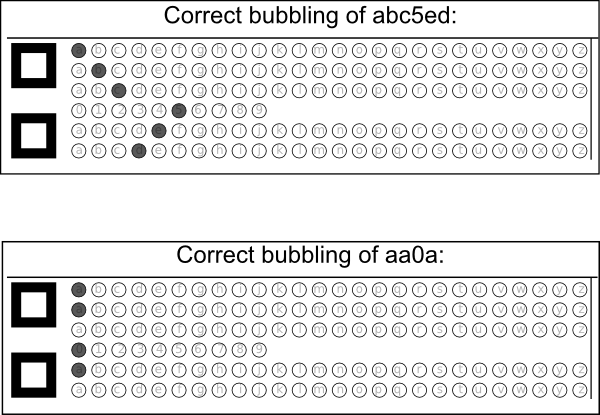

---
title: "Lab 5: Coding on Paper"
...

# Attendance

We will be taking roll in lab each week! Please come to your assigned lab to be counted present!

Each lab TAs are empowered to select their own method of taking roll.
Please follow your lab TA's instructions.  
They may dock points if you  are excessively late or leave unusually early.

# Prepping for the Exam

For various reasons, CS 1110 exams are given on paper and involve writing code by hand.
The goal of this lab is to prepare you for that: both the on-paper coding and the idea of being tested.

## TPEGS

We use a system called TPEGS to scan, grade, and return your paper exams.
For this to work, you need to fill in a bubble sheet on the first page of your exam.
The bubble region looks like this:

You fill in your computing ID, skipping rows if you have less than 6 characters in your id, like this:

The footers are read optically, so please fill in the bubbles darkly (either with ink or dark pencil).

## Lab mechanics

This lab will run as follows:

1.  The TAs will review what you've learned this week
1.  Paper coding questions will be distributed; you'll have some time to work on them
1.  The TAs will show the reference solution and the grading rubric; you'll grade your own papers

## Grading rubrics

Every piece of code looks a little different and we don't expect perfection on paper, but here are some thing we do look for:

1.  Neatness.  It should be easy to read what you wrote.

    -   Handwriting shouldn't require a huge effort to understand
    -   Indentation should line up pretty well -- it needn't be perfectly straight, but there should be no ambiguity what's indented how much
    -   We expect you to get colons, key-words, and parentheses right (e.g., `def baz(x, y):`{.python} not `define baz[x, y]`)

2.  Correctness.  The algorithm you write should solve the problem given.

    -   Partial credit for solving some cases but not all (but no credit for [hard coding](faq.html#what-is-hard-coding)
    -   Partial credit for comments outlining a good approach without supporting code
    -   Partial credit for a few missing bits

3.  Constraints.  Follow the directions...

    -   If we say "Write a function named `xyxxy`", don't name yours `quux` instead
    -   If we say "Write a function" give us a function, not a program
    -   Don't confuse input for arguments, nor return for print

We'll show you an actual point break-down after you code---we make custom rubrics for each question, often giving away part of the answer, so you won't get to see the rubric before you code.

