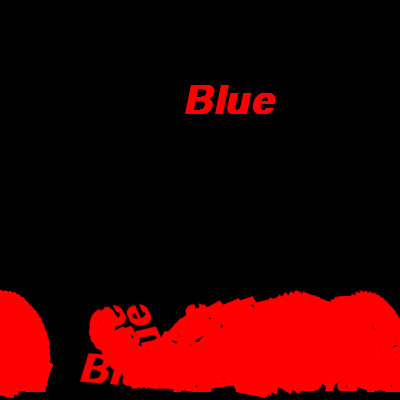

---
title: "Lab 11: Gamebox Intro"
...


# Attendance

Attendance in this lab is *optional*.
It's purpose is to get pygame and gamebox installed and working.
If you did that on your own, no need to come to lab.

Because it is optional, we are inviting 1111 students who are having trouble installing pygame to visit the 1110 labs too.

# What is this lab all about?

We'll be using game programming to synthesize many aspects of the semester in a project.
The introduction to that material will be in the following several lectures,
but getting set up can take some work.
This lab will be a time to set up and play with some basic code.

# Setup

We'll use several libraries that are not included with Python by default.
Install them in order:

## Installing PyGame

You should install PyGame on your laptop.
PyGame is a library designed for opening windows, drawing shapes and images, playing sound, etc.
How you get it depends on your operating system.

### Windows

1.  Determine what version of Python you are running.
    In PyCharm, [open the Python Console](revised2.2.html) and look for the line that begins `Python 3.`*something* (it's generally two lines from the bottom of the console.
    For example, you might have `Python 3.6.1`.

2.  Download one of the following based on the first two digits of your Python version:
    
    -   3.4: [pygame-windows-3.4.whl](files/pygame-windows-3.4.whl)
    -   3.5: [pygame-windows-3.5.whl](files/pygame-windows-3.5.whl)
    -   3.6: [pygame-windows-3.6.whl](files/pygame-windows-3.6.whl)
    
    We suggest you put these in the same directory as your `.py` files.

4.  Getting `pip`, a python package installer we'll use to install the `whl` file you downloaded above.
    Download <http://cs1110.cs.virginia.edu/code/get-pip.py>.

5.  Install things from within PyCharm, as follows:
    
    -   [Open the Python Console](revised2.2.html) and copy everything on the very first line up to the first space.
        Typically this is something like `C:\Users\mst3k\AppData\Local\Programs\Python\Python36\python.exe`,
        though the exact content may vary by how you installed Python.
    
    -   [Open the Terminal](revised2.2.html) and enter three lines, one at a time in order,
        each beginning with a paste of what you copied:
        
        a.  *paste* `get-pip.py`
        a.  *paste* `-m pip install wheel`
        a.  *paste* `-m pip pygame-windows-3.6.whl` (replace `3.6` with the number you downloaded in step 2).
        
    -   If the above failed, the following might work (again in the terminal):

        a.  *paste* `-m pip install pygame`
        
        This simpler method is slated to become the default in the future, but not all systems support it yet.
        
If you have trouble, ask a TA.  If they have trouble too, come see a professor during office hours.

### OS X

1.  Download and install [XQuartz - https://dl.bintray.com/xquartz/downloads/XQuartz-2.7.11.dmg](https://dl.bintray.com/xquartz/downloads/XQuartz-2.7.11.dmg).

2.  Open a Terminal window (Applications → Utilities → Terminal).  In the terminal window, paste the following commands in one at a time and run them individually:

    1.  `xcode-select --install`{.bash}
    2.  `ruby -e "$(curl -fsSL https://raw.githubusercontent.com/Homebrew/install/master/install)"`{.bash}
    3.  `alias brew=/usr/local/bin/brew`{.bash}
    4.  `brew install mercurial`{.bash}
    5.  `brew install git`{.bash}
    6.  `brew install sdl sdl_image sdl_mixer sdl_ttf smpeg portmidi`{.bash}
    7.  `pip3 install hg+http://bitbucket.org/pygame/pygame`{.bash}

If you have trouble, ask a TA.  If they have trouble too, come see a professor during office hours.


### Ubuntu, Debian, etc.

The exact process changes a bit based on which distro head your `apt` engine points to... try the following (all to be run in a terminal, either [in PyCharm](revised2.2.html) or on its own).
If any one works, you're good to go.

-   `sudo apt-get install python3-pygame`{.bash}

-   `sudo yum install python3-pygame`{.bash}

-   `python3 -m pip install pygame --user`{.bash}

-   `pip3 install pygame --user`{.bash}

-   If you have an old version of python, you might need to do the following:

    ````bash
    sudo apt-get install libsdl-dev libsdl-ttf2.0-dev libsdl-image1.2-dev libsdl-mixer1.2-dev portmidi
    sudo apt-get install python3-pip
    sudo pip3 install --upgrade pip
    sudo pip3 install pygame
    ````

If you have trouble, ask a TA.  If they have trouble too, come see a professor during office hours.

## Getting Gamebox

Gamebox is a bunch of python code we wrote to simplify the use of PyGame for writing simple 2D games.
Download it into your PyCharm project directory:

<http://cs1110.cs.virginia.edu/code/gamebox/gamebox.py>

If you run `gamebox.py` direcly you should see something like this:



If you have trouble getting fonts / text to work, try opening a terminal window and running `fc-list`{.bash}. Let that run to completion and try again.

If you don't see this window, *please* see a TA or professor to get it working before moving on!


# PyGame Examples

Every PyGame / gamebox game looks basically the same.
We'll discuss this in some detail over the coming class sessions, but if you want a head start you can try the following codes.

## Blank game

````python
# blank game template

import pygame
import gamebox
camera = gamebox.Camera(800,600)

def tick(keys):
    # to check if a key is pressed do, e.g., if pygame.K_LEFT in keys
    # to check the mouse, use camera.mouse (for position) or camera.mouseclick (for buttons)

    # typically here you update the position of the characters
    # then you call camera.draw(box) for each GameBox you made

    # usually camera.display() should be the last line of the tick method
    camera.display()

ticks_per_second = 30

# keep this line the last one in your program
gamebox.timer_loop(ticks_per_second, tick)
````

Your code will mostly go inside the `tick` function.
This function is called 30 times per second (as you can see from the code).
You should typically leave it at 30.
You can add other functions and variables outside of `tick`, but the main part of your game will go here.

Run this game. You should see a blank box.

## Movable character

Let's add a small, basic character to our game and give us control over it.
Change your code so it looks like this now:

````python
# our first game
import pygame
import gamebox

camera = gamebox.Camera(800,600)
character = gamebox.from_color(50, 50, "red", 30, 60)

def tick(keys):
    if pygame.K_RIGHT in keys:
        character.x += 5
    if pygame.K_LEFT in keys:
        character.x -= 5
    camera.clear("cyan")
    camera.draw(character)
    camera.display()

ticks_per_second = 30

# keep this line the last one in your program
gamebox.timer_loop(ticks_per_second, tick)
````

Give it a try! See what happens when you use the left and right keys!


## Gravity

Let's add some code to make our character obey gravity.

First, after you create the character, give it a `yspeed`:

````python
character.yspeed = 0
````

This behavior roughly treats the character like a `dict`, except you say `character.yspeed` instead of `character['yspeed']`.

Then, inside `tick`, you can apply gravity to your character:

````python
character.yspeed += 1
character.y = character.y + character.yspeed
````

Try out your code!

## Making a floor

Well... that was interesting.
Let's add a floor so our character doesn't fly off the screen.

````python
ground = gamebox.from_color(-100, 600, "black", 3000, 100)
````

The above line defines a ground box, but doesn't display it.
To get it to show up, inside `tick` but above `camera.display()` add:

````python
camera.draw(ground)
````

Now it exists, and it is drawn, but it doesn't handle collsions.
To do that, we need to add some collision detection and resolution code to `tick`:

````python
if character.bottom_touches(ground):
    character.yspeed = 0

if character.touches(ground):
    character.move_to_stop_overlapping(ground)
````

The first `if` statement makes it so your character stops falling.
The second statement ensures it doesn't get stuck inside the floor!
This can happen if the character is moving too fast when the collision occurs.


