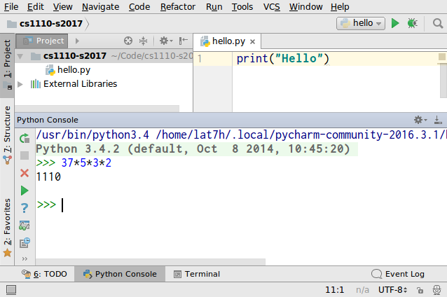
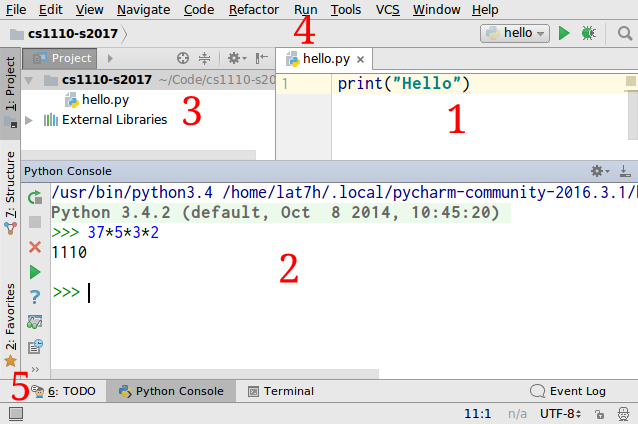

---
title: 2.2 Creating Python Programs (revised)
...

# Creating Python Programs

Python programs are created in the form of files.
By convention, the name of the file that contains a Python program has the extension `.py`.

We will write our Python programs using an environment to create programs in, which is called PyCharm.
Unlike the IDLE environment discussed in our text, PyCharm has many features that make it easier to write good programs, tools like spell-check but for programmers instead of authors.

## Projects

When you start PyCharm the first time you will be taken to a project selection page.
PyCharm is desiged to work best with Projects, which are generally groups of python files in a shared directory.
We suggest you create just one project for this course, in a directory you can find again later, and use it for all of your practice and assignments.

When creating a project, you specify both a directory to store the project and a "Project Interpreter".  Make sure the interpreter has the number 3 in its name.

### Using PyCharm well

Some students are tempted to use PyCharm in a way that will cause various strange errors.  The following simple rule will help you use PyCharm effectively:

> Open `.py` files *from* PyCharm, not *with* PyCharm

By this we mean that the correct order to open a downloaded `.py` file is

1. Download the file
2. Move the downloaded file to the directory of your PyCharm project
3. If it is not already running, run PyCharm
4. Use PyCharm's Project explorer to locate and open the file

Your operating system might or might not also allow you to double-click on a python file and have it come up in PyCharm, but opening files *with* PYCharm that way bypasses PyCharm's project structure and can result in unexpected problems, like files not running properly or not saving correctly.

## A Guide to Pycharm

There are several parts of PyCharm with which to become familiar, numbered in the screen-shot above.

1. The **Editor** window; this is where you can view, edit, and write Python files.  You'll spend most of your time here.

2. The **Python Console**.  This is PyCharm's version of what the book calls the "Python shell" and is a place where you can try out snippets of Python code interactively.  If you don't see the Python Console, see entry 5 in this list.

3. The **Project explorer**; this is where you can see the files that PyCharm knows are in the current project.  It should update itself when you create files, move files into the project directory, etc, but if not you can force an update by right-clicking on your prject name and selecting "Synchronize *project-name*" from the menu that appears.

4. The menus and toolbar. Notably, the *Run* menu is where you can tell PyCharm to run your code.  Entries in the menus will often have a keyboard shortcut listed next to them; if you find yourself doing something often, learning the keyboard shortcut can simplify your work.

5. In the bottom left corner of the screen are the view toggle button and pane content selectors. Depending on if it is toggled on or off, just above the grey square toggle button is a list of options about what to display in the bottom pane (including the Python Console (2)), and to the left is a sideways list of options about what to display in the left pane (including the Project explorer (3)).

PyCharm's view is highly cutomizable, which means you might accidentally customize it until you can't find what you want to anymore.  If you can't see the things you want to see in the PyCharm display, the *Window* menu (4) has an option "Restore default layout."

## Alternatives

PyCharm is an editor for Python, the same way a word processor is an editor for English.  And, just as there are many word processors (and many human languages), there are many editors (and many computer languages).

PyCharm Community Edition fills a position similar to LibreOffice: it's free, fully-featured, has the programmer's equivalent of spell-check, etc.
There are also editors with more features that cost money, similar to the various commercial word processeors out there;
online editors similar to the various online document processors out there;
editors that are customized to other languages, that can handle many languages, that are simpler but less feature-rich, etc.

In the end, if you can write good English prose, you can use any word processor to do so; and, similarly, if you can write good Python programs, you can use any editor to do so.
We'll all use the same editor in this class, but just to make it easier for us to all stay in sync, not because there is any magic to PyCharm over any other editor.

