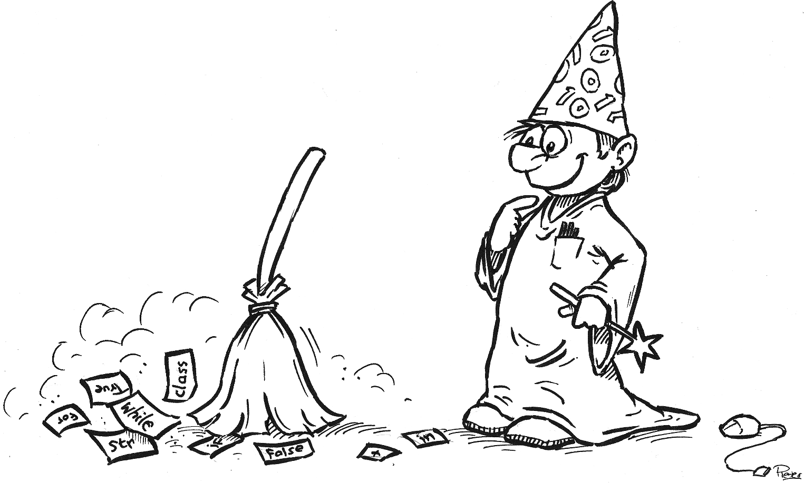

---
title: Spring 2017 Syllabus
...

# Basic Info

2017 Spring Semester

Course website: [http://cs1110.cs.virginia.edu](http://cs1110.cs.virginia.edu)

Lectures and Labs: see [main page](http://cs1110.cs.virginia.edu)

## Office Hours

All office hour times are posted on the course calendar at the bottom of the Schedule page on the course website.
TA office hours are held in the Thornton Stacks lab
(the large room in the middle of the top floor of the A-wing of Thornton Hall).
Professor office hours are held in their respective offices.

If you are attending TA office hours, please sign in on the Office Hour queue web site at [https://stardock.cs.virginia.edu/cs1110/oh](https://stardock.cs.virginia.edu/cs1110/oh) to request help. 
Faculty member office hours do not use the Office Hour queue.

# Contact

Running a course as large as Introduction to Programming requires some coordination.
Please help us by directing your contact in the right direction.

Purpose | Appropriate Contact
--------|--------------------
Q about course topics | In-class questions, office hours, or Piazza
Q about code not working | Office hours
Q about [grading](#grading-concerns-and-appeals) | Piazza (private post visible to all instructors)
Conversations about mentoring, research, student life, etc. | Office hours or schedule one-on-one visit
Personal issues impacting coursework | Your dean, and/or private email to your section's instructor


Luther Tychonievich
:   Office: Rice 208
    
    Office hours: Monday 11-12; Tuesday 2--4; Wednesday 3:00--4:00.
    Unless otherwise arranged, I will not have office hours on days of exams.

    Email: tychonievich@virginia.edu
    
    Comments: I read email once a day, 5 days a week, if it contains 1110 in the subject line.  I get so much email that **email without 1110 in the subject line often goes unread**.

Upsorn Praphamontripong
:   Office: Rice 206

    Office hours: Wednesday 2:00--4:00; Thursday 9:30-11:30

    Email: up3f@virginia.edu 

    Comments: I read email during work hours only, if it contains 1110 in the subject line.  I get so much email that **email without 1110 in the subject line often goes unread**.

Craig Dill
:   Email: cd9au@virginia.edu 
    
    Office hours: Monday and Wednesday 11--12:45 in Rice 514

Teaching Assistants
:   TA office hours are held in the Stacks in Thorton A wing, 3:00--9:00 Sunday through Thursday.
    See [the office hours tab](oh.html) for more on how to get their help.

    Our teaching assistants are students too.
    Please show them respect and only contact them via piazza, or in person during their scheduled office hours.
        
    Pestering our TAs when they are off the clock can be penalized under the "professionalism" clause of our grading policy.

Message boards
:   Piazza @ [https://piazza.com/class/iwxt2sk0gjf72b](https://piazza.com/class/iwxt2sk0gjf72b)
    
    Log in to Piazza and use the threads for quick questions, assignments, and for discussion with other students and staff.
    
    You can also post private messages here that will only be seen by staff members.
    This includes regrade requests for homework assignments.
    Make sure all private messages are visible to *all* instructors, not just one or two.

# Text

## Primary Text

<span class="floater"></span>

*The Coder's Apprentice* by Pieter Spronck; available online for free: [http://www.spronck.net/pythonbook/](http://www.spronck.net/pythonbook/)

So far as we know, no print version of this book is available.

<div style="clear:both;"></div>

## Optional resource

<span class="floater"></span>

*Starting Out with Python* by Tony Gaddis; available via the UVA bookstore or for purchase online.

We will not refer to this text explicitly, but if you want a printed reference this is a good pick.

<div style="clear:both;"></div>

# Course Requirements

You should meet the following requirements to take this class:

-   Can attend class regularly.
-   For 1110, can attend lab regularly.
-   For 1111, some previous programming experience is required.

# Assessment

In common with many courses in CS, we use a point-based grading system.

Task | Weight | Comments
-----|--------|----------
Programming assignments | 40% | Solo programming assignments will be due almost every week, and will be weighted equally
Project | 5% | A larger partner project will be worth more points than the average assignment
Exam 1 | 15% |  
Exam 2 | 15% |  
Final Exam | 15% | Per College policy, "Unexcused absence from a final examination results in an automatic grade of F in the course."
Participation and Quizzes | 10% | For 1110, most participation points are awarded by lab attendance and completion of lab assignments.  Each lecture section may also independently assign some of these points to in-class activities or the like.
Professionalism Penalty | 0--100% | Excessive missed classes, rude behavior toward instructor or classmates, unauthorized homework assistance, pestering TAs when they are not on the clock, etc., can be held against a student when final grades are calculated.

Your final letter grade will be calculated as follows:

You get|if you score|GPA value
--|------------|---
A+|near the top|4.0
A |≥ 93%|4.0
A−|≥ 90%|3.7
B+|≥ 86%|3.3
B |≥ 83%|3.0
B−|≥ 80%|2.7
C+|≥ 76%|2.3
C |≥ 73%|2.0
C−|≥ 70%|1.7
D+|≥ 66%|1.3
D |≥ 63%|1.0
D−|≥ 60%|0.7
F |otherwise|0.0

**Rounding:** By default, grades will not be rounded in this course.

**Pass/Fail/Audit:** A course average of 65.0% or higher with at least one passing exam grade is required for successful completion.

# Class Management

## General

- Faculty Office Hours -- We in general have an "open door" policy, in that if our door is open, by all means stop on in and say "hi" or ask a question. If our doors are closed, then we're heads down on some task, on the phone, in a meeting, etc. It's always a good idea to email or call before coming to make sure we're here if it's not office hours.
- When posting on Piazza, please use the search feature first; we prefer not to answer the same question repeatedly.
- If you email, please put 1110/1111 somewhere in the subject. It makes it easier on the staff. And please don’t just reply to an email sent over a month ago. That makes it harder to keep up with your email.
- Please don’t hesitate to contact us if you have any problems, concerns, questions, or issues regarding the course, material, or anything else in the class.

## Academic Honor

- Many students taking this course have never programmed before and might not know what plagiarism of code looks like.
- Sitting beside another student and doing your homework together such that your code looks identical is considered an honor violation.
- In general, follow these guidelines:

Action|Response
------|--------
Using ideas or code from class or textbook|OK
Using ideas from a TA or instructor|OK
Using the course's development tool's built-in suggestions|OK
Using ideas from https://docs.python.org/3/|OK
Using code from a TA, instructor, or the textbook|OK, but cite the source
Using code from https://docs.python.org/3/|OK, but cite the source
Using general ideas from another student, tutor, or website|OK, but cite the source
Using code from another student, tutor, or website|Cheating
Sharing your code with another student, organization, or website|Cheating

Citing is done in a comment or docstring in your code, like this:

````python
"""Source of help:
  I found the distance formula on http://this.web.site/here 
  I talked over ideas with my friend Thomas Jefferson (tj1a)
"""
````

We often re-use assignments from one semester to the next.
Do not share your solutions even after the semester is over.
We reserve the right to modify your grade after the fact if we discover you have facilitated others' cheating.

## Homework Assignments

- Homework assignments will not be handed out in class. Everything will be available online.
- Every file should begin with your name and ID in a comment.
- You should cite any ideas you discuss with other students or outside resources. Using any code written by another student, tutor, or website is considered a violation of the honor code.
- See the HW page and the automated grading system page for more information.
- Late policy: Programming assignments can be submitted up to 2 days late, with a 10% penalty for each day late. Assignments are not accepted after 2 days past the deadline.

## Generality of Solutions

Both assignments and exams will frequently describe general problems to be solved, and also give a few concrete examples.
Presenting a solution that works for those specific examples but does not attempt to solve the general problem is a form of the [anti-pattern](https://en.wikipedia.org/wiki/Anti-pattern) called **[hard coding](faq.html#what-is-hard-coding)** and will usually be graded the same as if you had not even attempted the problem.

## Partners

There will be a partner project in this course. Details of the groups are:

- Normal group size is two. Group sizes of three might arise. Expectations will be adjusted to reflect available person power.
- You will remain in the same group for the entire assignment unless you are asked to change.
- You must partner with someone in your own lab section (or within 1111 if that is the case).
- In general, all group members will receive the same grade for graded assignments. However, group members will evaluate their peers and any student who appears to not be contributing may be penalized.

You are expected to work as a member of your group in this course and cooperate with your colleagues.
Cooperation means attending group meetings, completing your assignments properly and on time, letting your group know if you will be out of town, responding to e-mail from your group, and so on.
If there is a lack of cooperation by any group member, it must be brought to the attention of the instructor as soon as it happens.
If the lack of cooperation is serious, the offending group member’s semester grade will be lowered. 

## Attendance

- Attendance in lecture is vital to learning the material and making a good grade in this class.
- We make no guarantees as to whether we will or will not take attendance or give a quiz on any given day.
- Any pop assignment we give cannot be made up.
- Attendance in 1110 lab is mandatory and it will be checked.

## Exams

- There will be a total of three formal exams during the course of the semester, counting the final exam.
- The midterm exams will be given in class. The final exam will be given during the university-set time.  Note that the university sets a special evening time for classes like 1110/1111 where multiple sections share one exam.
- Any exam that is missed due to any absence that is not a University Excused Absence will result in a zero (0) for that grade.  Note that vacation travel is not excused.
- Any exam that is missed due to a University Excused Absence or due to circumstances that are approved by your instructor beforehand must be made up within a week of the missed exam.

## Grading concerns and appeals

**Exam** regrades are submitted via TPEGS (which will also be where you will find out how you did on the exams).

**POTD** and **Lab** regrades are submitted on a private post on Piazza, tagged both **regrade_request** and the lab section in which you are enrolled (e.g. **lab107-930**).

Both forms of regrade requests are subject to the following policies:

-   All regrade requests must be made within one week of the assignment being returned to the student.
-   We will regrade serious errors in judgement; we will not regrade partial credit judgement calls.
-   When regrading, we reserve the right to regrade the entire exam or assignment, which may result in either an increase or a decrease in your grade. We are not trying to scare off students whose exams or assignments were graded incorrectly, but we are trying to avoid frivolous requests.

What should be regraded?

-   Your answer is the same as what is on the key, but the grader didn’t realize it.
-   Your answer is different, but is also correct (code that compiles and runs correctly, but is different than the key).

What should not be regraded?

-   “Most of what I wrote is correct, so I think I deserve more partial credit.”
-   “I wrote so much, and the grader didn’t notice that the correct answer is buried somewhere within this long paragraph.”
-   “I’m just 1 point away from an A, so I thought it was worth scrounging around to find an extra point somewhere.”

We reserve the right to dock professionalism points for frivolous regrade requests.


# Professionalism

In this course, there will be a focus on working well together and learning about the development process. A large portion of that process involves interpersonal skills and conflict management. Students and staff are all expected to treat each other with respect. This includes, but certainly is not limited to:

- Excessive web browsing during class
- Disrespectful language
- Promptness for all deadlines and class meetings
- Quality work

Students can and will be penalized for unprofessional behavior.

If a student submits code that was not authored by that student (i.e. copied from another student or from the Internet), or if another student submits code that matches a student's code, then the student's overall course grade will be dropped significantly.

# Research

Your class work might be used for research purposes. For example, we may use anonymized student assignments to design algorithms or build tools to help programmers. Any student who wishes to opt out can contact the instructor or TA to do so after final grades have been issued. This has no impact on your grade in any manner.

# Academic Integrity

The School of Engineering and Applied Science relies upon and cherishes its community of trust. We firmly endorse, uphold, and embrace the University’s Honor principle that students will not lie, cheat, or steal, nor shall they tolerate those who do. We recognize that even one honor infraction can destroy an exemplary reputation that has taken years to build. Acting in a manner consistent with the principles of honor will benefit every member of the community both while enrolled in the Engineering School and in the future.

Students are expected to be familiar with the university honor code, including the section on academic fraud ([http://www.virginia.edu/honor/what-is-academic-fraud-2/](http://www.virginia.edu/honor/what-is-academic-fraud-2/)). Each assignment will describe allowed collaborations, and deviations from these will be considered Honor violations. If you have questions on what is allowable, ask! Unless otherwise noted, exams and individual assignments will be considered pledged that you have neither given nor received help. (Among other things, this means that you are not allowed to describe problems on an exam to a student who has not taken it yet. You are not allowed to show exam papers to another student or view another student’s exam papers while working on an exam.) Send, receiving or otherwise copying electronic files that are part of course assignments are not allowed collaborations (except for those explicitly allowed in assignment instructions).

Assignments or exams where honor infractions or prohibited collaborations occur will receive a zero grade for that entire assignment or exam. Such infractions will also be submitted to the Honor Committee if that is appropriate. Students who have had prohibited collaborations may not be allowed to work with partners on remaining homeworks.

# SDAC and Other Special Circumstances

If you have been identified as an SDAC student, please let the Center know you are taking this class. If you suspect you should be an SDAC student, please schedule an appointment with them for an evaluation. We happily and discretely provide the recommended accommodations for those students identified by the SDAC. Please contact us at least one week before an exam so we can make accommodations. Website: [http://www.virginia.edu/studenthealth/sdac/sdac.html](http://www.virginia.edu/studenthealth/sdac/sdac.html)

If you have other special circumstances (athletics, other university-related activities, etc.) please contact your instructor and/or Head TA as soon as you know these may affect you in class.

# Weather-Related Issues

Please follow official University channels, including the University website and Twitter feed, for information on official closings. Also check your email regularly. If any given faculty member cannot make it to a lecture, an email will inform students with instructions as to what to do. Assume lectures and labs are happening unless an announcement is made.


# This Syllabus

This syllabus is to be considered a reference document that can and will be adjusted through the course of the semester to address changing needs. This syllabus can be changed at any time without notification. It is up to the student to monitor this page for any changes. Final authority on any decision in this course rests with the professor, not with this document.

